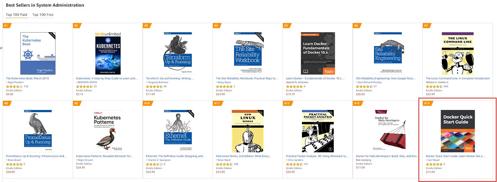

# LiveDockerTraining

- Chapter 01 - Setting up your Docker Environment
- Chapter 02 - Learning Docker Commands
- Chapter 03 - Creating Docker Images
- Chapter 04 - Docker Volumes
- Chapter 05 - Docker Swarm
- Chapter 06 - Docker Networking
- Chapter 07 - Docker Stacks
- Chapter 08 - Docker and Jenkins

---
**Docker Quick Start Guide** reached #14 on the Top 100 Paid best sellers list in the System Administration category.

If you have a desire to get a physical copy of the book, or want to share a review, here is a link to the book on Amazon.
https://amzn.to/2VtXybP
